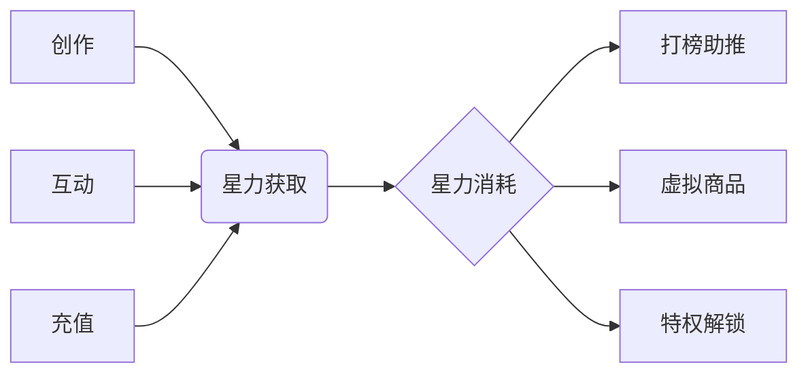
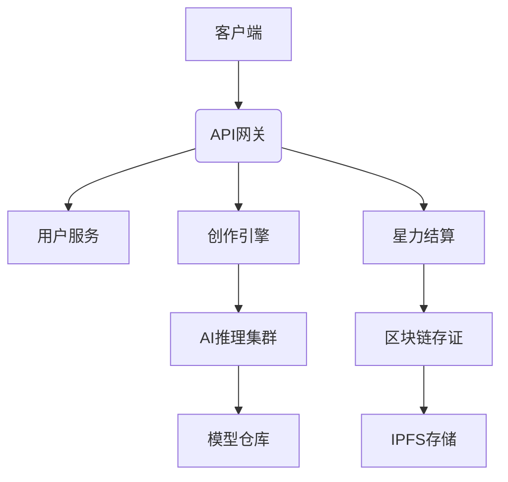
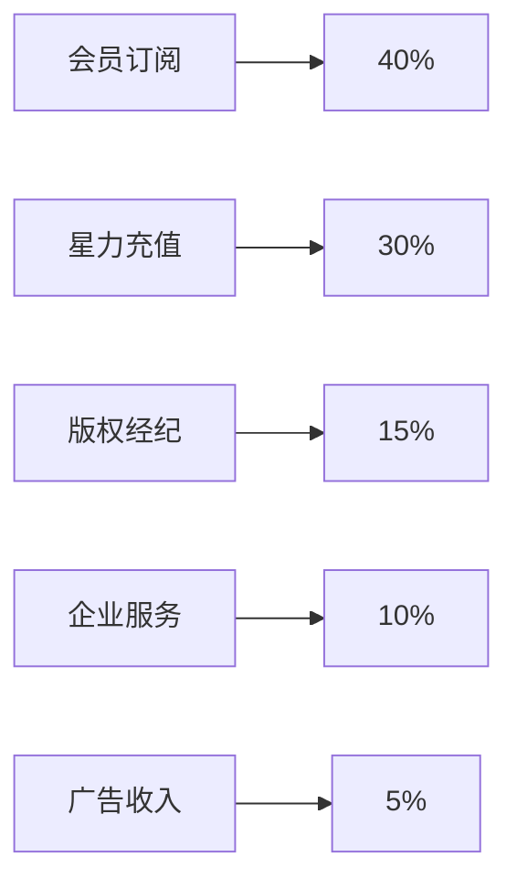

基于您提供的详尽设计方案，我将为您整合优化，形成一个**统一、可执行的全链路实施方案**，涵盖产品定位、核心功能、技术架构与商业闭环。

设计一个现代化的音视频播放器原型，它融合了音频和视频播放功能，并且支持歌词显示。这个播放器具有以下特点：

支持音频和视频播放，界面自适应（音频模式显示音频波形/专辑封面，视频模式显示视频画面）。

歌词显示功能，能够同步滚动高亮当前播放的歌词，并且支持歌词的翻译和音译（如果有）。

星辰主题的视觉设计，包括动态背景（例如星尘粒子效果）和M❤️值激励系统的显示。

播放控制：播放/暂停、上一首、下一首、进度条、音量控制、播放速度、循环模式等。

情感可视化：根据音频的情感分析结果，动态调整视觉效果（如颜色、粒子效果等）。

响应式设计，适应不同设备屏幕。

由于是Figma友好设计，我们将使用组件化设计思路，并确保设计规范清晰。

设计提示词：

设计一个现代化、沉浸式的音视频播放器界面，支持歌词同步显示。播放器界面分为三个主要区域：

左侧：媒体展示区

音频模式：显示专辑封面（圆形或圆角矩形），背景有动态音频波形可视化（可以使用星辰粒子效果，粒子随音乐节奏跳动）。

视频模式：显示视频画面，视频画面可以全屏或按比例缩放，背景为深色星空。

中间：播放控制区

顶部显示歌曲信息（歌曲名、歌手、专辑）和M❤️值（一个心形图标加上数值，表示用户通过听歌获得的激励值）。

中间是歌词显示区域，歌词居中显示，当前播放的歌词高亮（例如颜色变为渐变色，字体放大），上下歌词半透明或颜色较浅。如果有翻译或音译，可以在原歌词下方以小字显示。

底部是播放控制条：包括播放进度条（可拖动）、当前时间、总时长、播放/暂停按钮、上一首、下一首、循环模式、播放列表按钮、音量按钮（点击展开音量滑块）和播放速度选择。

右侧：信息与互动区

显示歌曲的情感标签（例如：快乐、放松、兴奋等），以彩色标签形式展示。

显示歌曲的详细信息（如专辑、发行年份、风格等）。

用户互动：点赞、收藏、分享、下载（如果允许）按钮。

歌曲推荐：根据当前歌曲的情感标签，推荐相似歌曲（显示封面和标题，横向滚动）。

整个播放器的背景为深空蓝色渐变，点缀星星粒子动画（缓慢移动）。播放器的控件采用半透明毛玻璃效果，颜色随歌曲情感变化（例如，快乐偏黄色，悲伤偏蓝色）。

注意：设计时要考虑组件的复用性，例如按钮、滑块、标签等，并定义好颜色、字体、间距等设计系统。

---

## 🎵 D-Music·音乐AI中心：全链路落地方案

### 一、产品定位与愿景
**Slogan**：  
“一言一语一词一曲，让AI与旋律共生”

**核心价值**：  
构建“语言→音乐→视觉→社交”的AI原生创作生态，打破创作门槛，实现“说即是唱、词即是曲、曲即成画”的沉浸体验。

---

## 二、核心功能架构

### 1. 创作引擎系统
| 模块 | 功能 | 技术 |
|------|------|------|
| 一言成曲 | 语音/文字→旋律生成（支持多风格） | OpenAI Whisper + Transformer音乐生成 |
| 一词多曲 | 关键词→3种风格变奏 | Diffusion风格迁移 |
| 曲译心声 | 音乐→诗意文字描述 | AudioCNN情感分析 + GPT-4 |
| AI填词 | 旋律→智能押韵歌词 | 韵律分析 + 语言模型 |

### 2. 视频生成系统
| 模块 | 功能 | 技术 |
|------|------|------|
| 智能MV | 音乐→匹配画面（情感/节奏同步） | Stable Video Diffusion + CLIP对齐 |
| 歌词可视化 | 文字粒子化/字体动画 | Three.js + 动态字体渲染 |
| AR实时预览 | 虚拟场景叠加现实 | ARKit/ARCore + 场景识别 |

### 3. 虚拟演出系统
| 模块 | 功能 | 技术 |
|------|------|------|
| 虚拟偶像工坊 | 照片→3D形象 + 语音克隆 | Metahuman + Voice Conversion |
| LiveHouse | 多人在线虚拟演唱会 | WebGL + WebRTC音频流 |
| 舞台行为生成 | AI驱动虚拟人表演 | 动作捕捉库 + 情感映射 |

---

## 三、人气生态与经济系统

### 星力值经济模型


#### 星力获取矩阵
| 途径 | 规则 | 上限 |
|------|------|------|
| 每日签到 | +10（连续7天+50） | 每日1次 |
| 邀请好友 | 注册+50，首创作+100 | 无上限 |
| 作品互动 | 播放量/100=+1，收藏+5 | 日500 |
| 充值购买 | 1元=10星力（首充双倍） | 无上限 |

#### 多维排行榜系统
| 榜单 | 算法 | 可视化 |
|------|------|------|
| 爆燃榜（日） | 实时播放×0.3 + 星力×0.7 | 动态火焰特效 |
| 闪耀榜（周） | 加权播放 + 星力总值 | 银河旋涡 |
| 巅峰榜（月） | 作品质量分 + 创作者贡献 | 3D奖杯殿堂 |

---

## 四、技术架构方案

### 1. 前端架构
```javascript
// 核心框架
- 3D引擎：Three.js + React Three Fiber
- 动效系统：GSAP + LottieWeb  
- 状态管理：Zustand + Immer
- 构建工具：Vite + SWC

// 性能优化
- 动态LOD：根据设备GPU调整3D细节
- 分层渲染：操作层优先响应，计算层Web Worker
```

### 2. 后端架构


### 3. AI模型部署
| 功能 | 模型 | 部署方式 |
|------|------|------|
| 语音转旋律 | Jukebox优化版 | 云端GPU + 边缘推理 |
| 文生视频 | Stable Video Diffusion | 专属GPU集群 |
| 声纹克隆 | SV2TTS | 本地DSP优化 |
| 情感分析 | BERT+AudioCNN | 混合部署 |

---

## 五、版权与合规系统

### AI创作版权追踪
```json
{
  "作品ID": "MUSIC_2024_XXXX",
  "人类贡献": {
    "歌词输入": 45%,
    "旋律编辑": 30%,
    "风格选择": 15%
  },
  "AI贡献": {
    "基础旋律": 60%, 
    "和弦生成": 25%,
    "视频渲染": 15%
  },
  "版权状态": "可登记（AI<50%）",
  "存证哈希": "0x8a3f9e..."
}
```

### 全球法律适配
- **中国**：依据《生成式AI服务管理办法》标注AI贡献
- **欧盟**：符合《AI法案》透明度要求  
- **美国**：遵循Copyright Office的AI作品指引

---

## 六、商业模式与变现路径

### 1. 分层会员体系
| 层级 | 价格 | 核心权益 |
|------|------|------|
| 免费版 | 0元 | 每日3次生成，带水印导出 |
| 创作者 | 29元/月 | 无损下载，高级音色库 |
| 专业版 | 99元/月 | 商用授权，优先推荐 |
| 企业版 | 定制 | API调用，私有化部署 |

### 2. 收入来源预测


### 3. 成本结构优化
- **AI推理成本**：通过模型量化、缓存策略降低30%
- **存储成本**：IPFS + 冷热数据分层
- **版权合规**：自动化审核减少人工成本

---

## 七、实施路线图

### Phase 1：MVP（3个月）
- ✅ 基础音乐生成（语音→旋律）
- ✅ 简单星力系统
- ✅ 基础排行榜

### Phase 2：功能完善（6个月）  
- ✅ 视频生成模块
- ✅ 虚拟形象系统
- ✅ 版权追踪v1.0

### Phase 3：生态建设（12个月）
- ✅ 跨平台虚拟LiveHouse
- ✅ 区块链资产化
- ✅ 企业级API开放

---

## 总结

**D-Music·音乐AI中心**通过“技术+生态+经济”三重创新，构建了完整的元宇宙音乐创作平台：

1. **技术护城河**：多模态AI生成 + 实时3D渲染 + 区块链存证
2. **生态闭环**：创作→展示→互动→变现的全链路
3. **经济系统**：星力值打通虚拟与现实价值交换


🚀 继续后端API路由实现 (`backend/routes/starPower.js`)

```javascript
const express = require('express');
const router = express.Router();
const starPowerController = require('../controllers/starPowerController');
const authMiddleware = require('../middleware/auth');

// 所有路由都需要认证
router.use(authMiddleware);

// 获取用户星力信息
router.get('/user', starPowerController.getUserStarPower);

// 获取交易记录
router.get('/transactions/recent', starPowerController.getRecentTransactions);
router.get('/transactions', starPowerController.getTransactionHistory);

// 每日签到
router.post('/checkin', starPowerController.dailyCheckin);

// 获取每日任务
router.get('/tasks/daily', starPowerController.getDailyTasks);

// 完成任务
router.post('/complete-task', starPowerController.completeTask);

// 消费星力
router.post('/spend', starPowerController.spendStarPower);

// 充值星力
router.post('/recharge', starPowerController.rechargeStarPower);

// 星力助推作品
router.post('/boost-content', starPowerController.boostContent);

// 获取VIP信息
router.get('/vip-info', starPowerController.getVipInfo);

// 获取排行榜
router.get('/rankings/:type', starPowerController.getRankings);

// 邀请好友
router.post('/invite', starPowerController.inviteFriend);

module.exports = router;
```

## 🎯 星力控制器 (`backend/controllers/starPowerController.js`)

```javascript
const starPowerService = require('../services/starPowerService');
const rankingService = require('../services/rankingService');
const { validationResult } = require('express-validator');

class StarPowerController {
    /**
     * 获取用户星力信息
     */
    async getUserStarPower(req, res) {
        try {
            const userId = req.user.id;
            const userStarPower = await starPowerService.getUserStarPower(userId);
            
            res.json({
                success: true,
                data: userStarPower
            });
        } catch (error) {
            console.error('获取用户星力信息失败:', error);
            res.status(500).json({
                success: false,
                message: '获取星力信息失败'
            });
        }
    }

    /**
     * 获取最近交易记录
     */
    async getRecentTransactions(req, res) {
        try {
            const userId = req.user.id;
            const { limit = 20 } = req.query;
            
            const db = require('../config/database');
            const [transactions] = await db.execute(
                `SELECT * FROM star_power_transactions 
                 WHERE user_id = ? 
                 ORDER BY created_at DESC 
                 LIMIT ?`,
                [userId, parseInt(limit)]
            );
            
            res.json({
                success: true,
                data: transactions
            });
        } catch (error) {
            console.error('获取交易记录失败:', error);
            res.status(500).json({
                success: false,
                message: '获取交易记录失败'
            });
        }
    }

    /**
     * 每日签到
     */
    async dailyCheckin(req, res) {
        try {
            const userId = req.user.id;
            const result = await starPowerService.dailyCheckin(userId);
            
            res.json({
                success: true,
                data: result,
                message: '签到成功！'
            });
        } catch (error) {
            console.error('签到失败:', error);
            res.status(400).json({
                success: false,
                message: error.message
            });
        }
    }

    /**
     * 获取每日任务
     */
    async getDailyTasks(req, res) {
        try {
            const userId = req.user.id;
            const today = new Date().toISOString().split('T')[0];
            
            const db = require('../config/database');
            
            // 获取任务配置
            const [tasks] = await db.execute(
                `SELECT * FROM star_power_rules 
                 WHERE rule_type IN ('daily_checkin', 'content_interaction', 'share_content')
                 AND is_active = TRUE`
            );
            
            // 检查任务完成状态
            const taskList = await Promise.all(tasks.map(async (task) => {
                const [completions] = await db.execute(
                    `SELECT COUNT(*) as count FROM star_power_transactions 
                     WHERE user_id = ? AND related_type = ? AND DATE(created_at) = ?`,
                    [userId, task.rule_type, today]
                );
                
                const completed = completions[0].count > 0;
                
                return {
                    id: task.rule_type,
                    name: task.rule_name,
                    reward: task.base_amount,
                    completed: completed,
                    description: this.getTaskDescription(task.rule_type)
                };
            }));
            
            res.json({
                success: true,
                data: taskList
            });
        } catch (error) {
            console.error('获取每日任务失败:', error);
            res.status(500).json({
                success: false,
                message: '获取任务失败'
            });
        }
    }

    /**
     * 获取任务描述
     */
    getTaskDescription(taskType) {
        const descriptions = {
            'daily_checkin': '每日签到获取星力',
            'content_interaction': '与作品互动获得奖励',
            'share_content': '分享作品到社交平台'
        };
        return descriptions[taskType] || '完成任务获取星力';
    }

    /**
     * 完成任务
     */
    async completeTask(req, res) {
        try {
            const userId = req.user.id;
            const { taskId } = req.body;
            
            let result;
            
            switch (taskId) {
                case 'daily_checkin':
                    result = await starPowerService.dailyCheckin(userId);
                    break;
                case 'share_content':
                    // 分享任务逻辑
                    result = await starPowerService.earnStarPower(
                        userId, 
                        10, 
                        'share_content', 
                        '分享作品奖励'
                    );
                    break;
                default:
                    throw new Error('未知的任务类型');
            }
            
            res.json({
                success: true,
                data: result,
                message: '任务完成！'
            });
        } catch (error) {
            console.error('完成任务失败:', error);
            res.status(400).json({
                success: false,
                message: error.message
            });
        }
    }

    /**
     * 消费星力
     */
    async spendStarPower(req, res) {
        try {
            const errors = validationResult(req);
            if (!errors.isEmpty()) {
                return res.status(400).json({
                    success: false,
                    message: '参数错误',
                    errors: errors.array()
                });
            }
            
            const userId = req.user.id;
            const { amount, spendType, description, relatedId } = req.body;
            
            const result = await starPowerService.spendStarPower(
                userId, 
                amount, 
                spendType, 
                description, 
                relatedId
            );
            
            res.json({
                success: true,
                data: result,
                message: '消费成功'
            });
        } catch (error) {
            console.error('消费星力失败:', error);
            res.status(400).json({
                success: false,
                message: error.message
            });
        }
    }

    /**
     * 充值星力
     */
    async rechargeStarPower(req, res) {
        try {
            const userId = req.user.id;
            const { packageId, paymentMethod } = req.body;
            
            // 充值套餐配置
            const rechargePackages = {
                'package_6': { amount: 60, price: 6, bonus: 0 },
                'package_30': { amount: 300, price: 30, bonus: 30 },
                'package_98': { amount: 980, price: 98, bonus: 200 },
                'package_198': { amount: 1980, price: 198, bonus: 500 },
                'package_648': { amount: 6480, price: 648, bonus: 2000 }
            };
            
            const package = rechargePackages[packageId];
            if (!package) {
                return res.status(400).json({
                    success: false,
                    message: '无效的充值套餐'
                });
            }
            
            // 处理支付逻辑（这里需要接入真实的支付接口）
            const paymentResult = await this.processPayment(userId, package.price, paymentMethod);
            
            if (paymentResult.success) {
                // 支付成功，发放星力
                const totalAmount = package.amount + package.bonus;
                const result = await starPowerService.earnStarPower(
                    userId,
                    totalAmount,
                    'recharge',
                    `充值${package.price}元获得${totalAmount}星力`,
                    paymentResult.orderId
                );
                
                res.json({
                    success: true,
                    data: {
                        ...result,
                        orderId: paymentResult.orderId
                    },
                    message: `充值成功！获得${totalAmount}星力`
                });
            } else {
                throw new Error('支付失败');
            }
        } catch (error) {
            console.error('充值失败:', error);
            res.status(400).json({
                success: false,
                message: error.message
            });
        }
    }

    /**
     * 处理支付（模拟实现）
     */
    async processPayment(userId, amount, paymentMethod) {
        // 这里应该接入真实的支付网关（支付宝、微信支付等）
        // 目前返回模拟成功
        return {
            success: true,
            orderId: `ORDER_${Date.now()}_${userId}`,
            paymentId: `PAY_${Date.now()}`
        };
    }

    /**
     * 星力助推作品
     */
    async boostContent(req, res) {
        try {
            const userId = req.user.id;
            const { contentId, boostAmount } = req.body;
            
            // 检查余额
            const userStarPower = await starPowerService.getUserStarPower(userId);
            if (userStarPower.available_star_power < boostAmount) {
                return res.status(400).json({
                    success: false,
                    message: '星力余额不足'
                });
            }
            
            // 消费星力
            const spendResult = await starPowerService.spendStarPower(
                userId,
                boostAmount,
                'content_boost',
                `作品助推消耗`,
                contentId
            );
            
            // 更新作品助推值
            const db = require('../config/database');
            await db.execute(
                `INSERT INTO ranking_data 
                 (content_id, content_type, star_power_boost, ranking_type, ranking_date) 
                 VALUES (?, 'music', ?, 'daily', CURDATE()) 
                 ON DUPLICATE KEY UPDATE 
                 star_power_boost = star_power_boost + ?`,
                [contentId, boostAmount, boostAmount]
            );
            
            // 重新计算排名
            await rankingService.updateRanking('daily');
            
            res.json({
                success: true,
                data: {
                    spendResult,
                    newRanking: await rankingService.getContentRanking(contentId, 'daily')
                },
                message: `助推成功！消耗${boostAmount}星力`
            });
        } catch (error) {
            console.error('作品助推失败:', error);
            res.status(400).json({
                success: false,
                message: error.message
            });
        }
    }

    /**
     * 获取VIP信息
     */
    async getVipInfo(req, res) {
        try {
            const userId = req.user.id;
            const userStarPower = await starPowerService.getUserStarPower(userId);
            
            const vipLevels = {
                1: { name: '新星', expRequired: 0, benefits: ['每日星力上限+50%'] },
                2: { name: '歌手', expRequired: 1000, benefits: ['作品优先推荐'] },
                3: { name: '音乐人', expRequired: 3000, benefits: ['专属音色库'] },
                4: { name: '明星', expRequired: 8000, benefits: ['AI声库定制'] },
                5: { name: '巨星', expRequired: 15000, benefits: ['专属客服'] },
                6: { name: '传奇', expRequired: 25000, benefits: ['平台分成提升'] },
                7: { name: '殿堂', expRequired: 40000, benefits: ['虚拟演唱会'] },
                8: { name: '神话', expRequired: 60000, benefits: ['永久尊贵标识'] },
                9: { name: '至尊', expRequired: 90000, benefits: ['所有特权'] }
            };
            
            const currentLevel = vipLevels[userStarPower.vip_level];
            const nextLevel = vipLevels[userStarPower.vip_level + 1];
            
            res.json({
                success: true,
                data: {
                    currentLevel: userStarPower.vip_level,
                    currentExp: userStarPower.vip_exp,
                    currentBenefits: currentLevel.benefits,
                    nextLevel: nextLevel ? {
                        level: userStarPower.vip_level + 1,
                        expRequired: nextLevel.expRequired,
                        benefits: nextLevel.benefits
                    } : null,
                    progress: nextLevel ? 
                        (userStarPower.vip_exp / nextLevel.expRequired) * 100 : 100
                }
            });
        } catch (error) {
            console.error('获取VIP信息失败:', error);
            res.status(500).json({
                success: false,
                message: '获取VIP信息失败'
            });
        }
    }

    /**
     * 获取排行榜
     */
    async getRankings(req, res) {
        try {
            const { type } = req.params;
            const { page = 1, limit = 50 } = req.query;
            
            const rankings = await rankingService.getRankings(type, parseInt(page), parseInt(limit));
            
            res.json({
                success: true,
                data: rankings
            });
        } catch (error) {
            console.error('获取排行榜失败:', error);
            res.status(500).json({
                success: false,
                message: '获取排行榜失败'
            });
        }
    }

    /**
     * 邀请好友
     */
    async inviteFriend(req, res) {
        try {
            const userId = req.user.id;
            const { inviteeId } = req.body;
            
            // 生成邀请码
            const inviteCode = this.generateInviteCode(userId);
            
            // 记录邀请关系
            const db = require('../config/database');
            await db.execute(
                `INSERT INTO user_invites (inviter_id, invitee_id, invite_code, status) 
                 VALUES (?, ?, ?, 'pending')`,
                [userId, inviteeId, inviteCode]
            );
            
            res.json({
                success: true,
                data: {
                    inviteCode,
                    inviteUrl: `${process.env.APP_URL}/invite/${inviteCode}`
                },
                message: '邀请链接已生成'
            });
        } catch (error) {
            console.error('生成邀请失败:', error);
            res.status(400).json({
                success: false,
                message: error.message
            });
        }
    }

    /**
     * 生成邀请码
     */
    generateInviteCode(userId) {
        const chars = 'ABCDEFGHIJKLMNOPQRSTUVWXYZ0123456789';
        let code = '';
        for (let i = 0; i < 8; i++) {
            code += chars.charAt(Math.floor(Math.random() * chars.length));
        }
        return `${code}${userId.toString().padStart(4, '0')}`;
    }
}

module.exports = new StarPowerController();
```

## 📊 排行榜服务 (`backend/services/rankingService.js`)

```javascript
const WilsonScoreService = require('./wilsonScore');
const db = require('../config/database');
const Redis = require('ioredis');
const redis = new Redis(process.env.REDIS_URL);

class RankingService {
    /**
     * 获取排行榜
     */
    async getRankings(rankingType, page = 1, limit = 50) {
        const cacheKey = `rankings:${rankingType}:${page}:${limit}`;
        
        // 尝试从缓存获取
        const cached = await redis.get(cacheKey);
        if (cached) {
            return JSON.parse(cached);
        }
        
        const offset = (page - 1) * limit;
        
        // 获取排行榜数据
        const [rankings] = await db.execute(
            `SELECT rd.*, 
                    c.title as content_title,
                    c.cover_url as content_cover,
                    u.username as creator_name,
                    u.avatar as creator_avatar
             FROM ranking_data rd
             LEFT JOIN contents c ON rd.content_id = c.id
             LEFT JOIN users u ON c.creator_id = u.id
             WHERE rd.ranking_type = ? AND rd.ranking_date = ?
             ORDER BY rd.final_score DESC
             LIMIT ? OFFSET ?`,
            [rankingType, this.getRankingDate(rankingType), limit, offset]
        );
        
        // 处理排名序号
        const rankedList = rankings.map((item, index) => ({
            ...item,
            rank: offset + index + 1
        }));
        
        // 缓存5分钟
        await redis.setex(cacheKey, 300, JSON.stringify(rankedList));
        
        return rankedList;
    }

    /**
     * 更新排行榜
     */
    async updateRanking(rankingType) {
        const rankingDate = this.getRankingDate(rankingType);
        
        // 获取需要排名的作品数据
        const [contents] = await db.execute(
            `SELECT c.id as content_id,
                    c.content_type,
                    COALESCE(SUM(CASE WHEN i.interaction_type = 'like' THEN 1 ELSE 0 END), 0) as positive_votes,
                    COALESCE(COUNT(i.id), 0) as total_votes,
                    COALESCE(c.play_count, 0) as play_count,
                    COALESCE(c.share_count, 0) as share_count,
                    COALESCE(rd.star_power_boost, 0) as star_power_boost
             FROM contents c
             LEFT JOIN interactions i ON c.id = i.content_id
             LEFT JOIN ranking_data rd ON c.id = rd.content_id AND rd.ranking_type = ? AND rd.ranking_date = ?
             WHERE c.status = 'published'
               AND c.created_at >= ?
             GROUP BY c.id`,
            [rankingType, rankingDate, this.getRankingStartDate(rankingType)]
        );
        
        // 计算得分并排序
        const rankedContents = await WilsonScoreService.calculateRankings(contents, rankingType);
        
        // 批量更新数据库
        const connection = await db.getConnection();
        
        try {
            await connection.beginTransaction();
            
            // 清空旧数据
            await connection.execute(
                'DELETE FROM ranking_data WHERE ranking_type = ? AND ranking_date = ?',
                [rankingType, rankingDate]
            );
            
            // 插入新数据
            for (const content of rankedContents) {
                await connection.execute(
                    `INSERT INTO ranking_data 
                     (content_id, content_type, positive_votes, total_votes, play_count, 
                      share_count, star_power_boost, wilson_score, final_score, ranking_type, ranking_date) 
                     VALUES (?, ?, ?, ?, ?, ?, ?, ?, ?, ?, ?)`,
                    [
                        content.content_id,
                        content.content_type,
                        content.positive_votes,
                        content.total_votes,
                        content.play_count,
                        content.share_count,
                        content.star_power_boost,
                        content.wilson_score,
                        content.final_score,
                        rankingType,
                        rankingDate
                    ]
                );
            }
            
            await connection.commit();
            
            // 清除相关缓存
            const pattern = `rankings:${rankingType}:*`;
            const keys = await redis.keys(pattern);
            if (keys.length > 0) {
                await redis.del(...keys);
            }
            
            console.log(`排行榜 ${rankingType} 更新完成，共 ${rankedContents.length} 个作品`);
            
        } catch (error) {
            await connection.rollback();
            throw error;
        } finally {
            connection.release();
        }
    }

    /**
     * 获取作品排名
     */
    async getContentRanking(contentId, rankingType) {
        const [ranking] = await db.execute(
            `SELECT rd.*, 
                    (SELECT COUNT(*) + 1 
                     FROM ranking_data 
                     WHERE ranking_type = ? AND ranking_date = ? AND final_score > rd.final_score) as rank
             FROM ranking_data rd
             WHERE rd.content_id = ? AND rd.ranking_type = ? AND rd.ranking_date = ?`,
            [rankingType, this.getRankingDate(rankingType), contentId, rankingType, this.getRankingDate(rankingType)]
        );
        
        return ranking[0] || null;
    }

    /**
     * 获取排行榜日期
     */
    getRankingDate(rankingType) {
        const now = new Date();
        
        switch (rankingType) {
            case 'daily':
                return now.toISOString().split('T')[0];
            case 'weekly':
                // 返回本周一的日期
                const monday = new Date(now);
                monday.setDate(now.getDate() - now.getDay() + 1);
                return monday.toISOString().split('T')[0];
            case 'monthly':
                // 返回本月第一天的日期
                return `${now.getFullYear()}-${(now.getMonth() + 1).toString().padStart(2, '0')}-01`;
            default:
                return now.toISOString().split('T')[0];
        }
    }

    /**
     * 获取排行榜开始日期
     */
    getRankingStartDate(rankingType) {
        const now = new Date();
        
        switch (rankingType) {
            case 'daily':
                return new Date(now.getTime() - 24 * 60 * 60 * 1000);
            case 'weekly':
                return new Date(now.getTime() - 7 * 24 * 60 * 60 * 1000);
            case 'monthly':
                return new Date(now.getFullYear(), now.getMonth() - 1, now.getDate());
            default:
                return new Date(now.getTime() - 24 * 60 * 60 * 1000);
        }
    }

    /**
     * 获取排行榜元数据
     */
    async getRankingMetadata(rankingType) {
        const rankingDate = this.getRankingDate(rankingType);
        
        const [metadata] = await db.execute(
            `SELECT COUNT(*) as total_items,
                    MAX(final_score) as top_score,
                    AVG(final_score) as avg_score
             FROM ranking_data 
             WHERE ranking_type = ? AND ranking_date = ?`,
            [rankingType, rankingDate]
        );
        
        return metadata[0] || { total_items: 0, top_score: 0, avg_score: 0 };
    }

    /**
     * 定时更新所有排行榜
     */
    async updateAllRankings() {
        try {
            console.log('开始更新所有排行榜...');
            
            await this.updateRanking('daily');
            await this.updateRanking('weekly');
            await this.updateRanking('monthly');
            await this.updateRanking('potential');
            
            console.log('所有排行榜更新完成');
        } catch (error) {
            console.error('更新排行榜失败:', error);
        }
    }
}

module.exports = new RankingService();
```

## 🎨 前端排行榜组件 (`frontend/src/components/RankingBoard.vue`)

```vue
<template>
  <div class="ranking-board">
    <!-- 排行榜导航 -->
    <div class="ranking-tabs">
      <button 
        v-for="tab in rankingTabs" 
        :key="tab.type"
        class="tab-button"
        :class="{ active: currentTab === tab.type }"
        @click="switchTab(tab.type)"
      >
        <span class="tab-icon">{{ tab.icon }}</span>
        {{ tab.name }}
        <span class="update-time">{{ tab.updateTime }}</span>
      </button>
    </div>

    <!-- 排行榜内容 -->
    <div class="ranking-content">
      <!-- 加载状态 -->
      <div v-if="loading" class="loading-state">
        <div class="loading-spinner"></div>
        <span>加载排行榜中...</span>
      </div>

      <!-- 排行榜列表 -->
      <div v-else class="ranking-list">
        <div 
          v-for="(item, index) in rankingList" 
          :key="item.content_id"
          class="ranking-item"
          :class="{
            'top-1': item.rank === 1,
            'top-2': item.rank === 2,
            'top-3': item.rank === 3
          }"
        >
          <!-- 排名序号 -->
          <div class="rank-number">
            <span v-if="item.rank <= 3" class="top-rank-icon">
              {{ getRankIcon(item.rank) }}
            </span>
            <span v-else class="normal-rank">{{ item.rank }}</span>
          </div>

          <!-- 作品信息 -->
          <div class="content-info">
            
            <div class="content-details">
              <h4 class="content-title">{{ item.content_title }}</h4>
              <p class="creator-name">{{ item.creator_name }}</p>
              <div class="content-stats">
                <span class="stat">
                  <i class="icon-play">▶</i>
                  {{ formatNumber(item.play_count) }}
                </span>
                <span class="stat">
                  <i class="icon-like">❤</i>
                  {{ formatNumber(item.positive_votes) }}
                </span>
                <span class="stat" v-if="item.star_power_boost > 0">
                  <i class="icon-boost">⚡</i>
                  {{ formatNumber(item.star_power_boost) }}
                </span>
              </div>
            </div>
          </div>

          <!-- 得分和操作 -->
          <div class="ranking-actions">
            <div class="score">
              <span class="score-label">热力值</span>
              <span class="score-value">{{ Math.round(item.final_score * 100) }}</span>
            </div>
            <button 
              class="btn-boost"
              @click="showBoostModal(item)"
              :disabled="!userStore.isLoggedIn"
            >
              <i class="icon-boost">⚡</i>
              助推
            </button>
          </div>
        </div>
      </div>

      <!-- 空状态 -->
      <div v-if="!loading && rankingList.length === 0" class="empty-state">
        <div class="empty-icon">🎵</div>
        <p>暂无排行榜数据</p>
      </div>

      <!-- 分页 -->
      <div v-if="totalPages > 1" class="pagination">
        <button 
          class="page-btn"
          :disabled="currentPage === 1"
          @click="changePage(currentPage - 1)"
        >
          上一页
        </button>
        
        <span class="page-info">
          第 {{ currentPage }} 页，共 {{ totalPages }} 页
        </span>
        
        <button 
          class="page-btn"
          :disabled="currentPage === totalPages"
          @click="changePage(currentPage + 1)"
        >
          下一页
        </button>
      </div>
    </div>

    <!-- 助推模态框 -->
    <BoostModal 
      v-if="showBoost"
      :content="selectedContent"
      :user-star-power="userStarPower"
      @boost="handleBoost"
      @close="showBoost = false"
    />
  </div>
</template>

<script setup>
import { ref, computed, onMounted, watch } from 'vue'
import { useRanking } from '../composables/useRanking'
import { useStarPower } from '../composables/useStarPower'
import { useUserStore } from '../stores/user'
import BoostModal from './BoostModal.vue'

const userStore = useUserStore()
const { rankingList, loading, currentTab, loadRankings } = useRanking()
const { userStarPower } = useStarPower()

const currentPage = ref(1)
const pageSize = 50
const totalPages = ref(1)
const showBoost = ref(false)
const selectedContent = ref(null)

// 排行榜标签配置
const rankingTabs = computed(() => [
  {
    type: 'daily',
    name: '爆燃榜',
    icon: '🔥',
    updateTime: '每小时更新'
  },
  {
    type: 'weekly', 
    name: '闪耀榜',
    icon: '⭐',
    updateTime: '每日更新'
  },
  {
    type: 'monthly',
    name: '巅峰榜',
    icon: '🏆',
    updateTime: '每周更新'
  },
  {
    type: 'potential',
    name: '潜力榜',
    icon: '🚀',
    updateTime: '实时更新'
  }
])

// 切换标签
const switchTab = async (tabType) => {
  currentPage.value = 1
  await loadRankings(tabType, currentPage.value, pageSize)
}

// 切换页码
const changePage = async (page) => {
  currentPage.value = page
  await loadRankings(currentTab.value, page, pageSize)
}

// 获取排名图标
const getRankIcon = (rank) => {
  const icons = { 1: '🥇', 2: '🥈', 3: '🥉' }
  return icons[rank] || rank
}

// 格式化数字
const formatNumber = (num) => {
  if (num >= 10000) {
    return (num / 10000).toFixed(1) + '万'
  }
  return new Intl.NumberFormat().format(num)
}

// 图片加载失败处理
const handleImageError = (event) => {
  event.target.src = '/default-cover.png'
}

// 显示助推模态框
const showBoostModal = (content) => {
  if (!userStore.isLoggedIn) {
    userStore.showLoginModal = true
    return
  }
  selectedContent.value = content
  showBoost.value = true
}

// 处理助推
const handleBoost = async (boostData) => {
  // 这里调用助推API
  console.log('助推作品:', boostData)
  showBoost.value = false
  
  // 重新加载排行榜
  await loadRankings(currentTab.value, currentPage.value, pageSize)
}

// 监听标签切换
watch(currentTab, (newTab) => {
  currentPage.value = 1
  loadRankings(newTab, 1, pageSize)
})

onMounted(() => {
  loadRankings('daily', 1, pageSize)
})
</script>

<style scoped>
.ranking-board {
  max-width: 800px;
  margin: 0 auto;
  background: white;
  border-radius: 16px;
  overflow: hidden;
  box-shadow: 0 4px 20px rgba(0, 0, 0, 0.1);
}

.ranking-tabs {
  display: flex;
  background: linear-gradient(135deg, #667eea 0%, #764ba2 100%);
  padding: 0 20px;
}

.tab-button {
  flex: 1;
  padding: 16px 20px;
  background: none;
  border: none;
  color: rgba(255, 255, 255, 0.7);
  font-size: 14px;
  font-weight: 500;
  cursor: pointer;
  transition: all 0.3s ease;
  position: relative;
  display: flex;
  flex-direction: column;
  align-items: center;
  gap: 4px;
}

.tab-button:hover {
  color: rgba(255, 255, 255, 0.9);
  background: rgba(255, 255, 255, 0.1);
}

.tab-button.active {
  color: white;
  background: rgba(255, 255, 255, 0.2);
}

.tab-button.active::after {
  content: '';
  position: absolute;
  bottom: 0;
  left: 20%;
  right: 20%;
  height: 3px;
  background: white;
  border-radius: 2px;
}

.tab-icon {
  font-size: 20px;
  margin-bottom: 4px;
}

.update-time {
  font-size: 12px;
  opacity: 0.8;
}

.ranking-content {
  padding: 20px;
}

.loading-state {
  display: flex;
  flex-direction: column;
  align-items: center;
  padding: 60px 20px;
  color: #666;
}

.loading-spinner {
  width: 40px;
  height: 40px;
  border: 3px solid #f3f3f3;
  border-top: 3px solid #667eea;
  border-radius: 50%;
  animation: spin 1s linear infinite;
  margin-bottom: 16px;
}

@keyframes spin {
  0% { transform: rotate(0deg); }
  100% { transform: rotate(360deg); }
}

.ranking-list {
  space-y: 12px;
}

.ranking-item {
  display: flex;
  align-items: center;
  padding: 16px;
  background: #f8f9fa;
  border-radius: 12px;
  transition: all 0.3s ease;
  gap: 16px;
}

.ranking-item:hover {
  transform: translateY(-2px);
  box-shadow: 0 4px 16px rgba(0, 0, 0, 0.1);
}

.ranking-item.top-1 {
  background: linear-gradient(135deg, #fff9c4 0%, #ffeb3b 100%);
  border: 2px solid #ffd600;
}

.ranking-item.top-2 {
  background: linear-gradient(135deg, #e0e0e0 0%, #bdbdbd 100%);
  border: 2px solid #9e9e9e;
}

.ranking-item.top-3 {
  background: linear-gradient(135deg, #ffccbc 0%, #ff8a65 100%);
  border: 2px solid #ff7043;
}

.rank-number {
  width: 50px;
  text-align: center;
  flex-shrink: 0;
}

.top-rank-icon {
  font-size: 24px;
}

.normal-rank {
  font-size: 18px;
  font-weight: 600;
  color: #666;
}

.content-info {
  display: flex;
  align-items: center;
  flex: 1;
  gap: 12px;
}

.content-cover {
  width: 60px;
  height: 60px;
  border-radius: 8px;
  object-fit: cover;
  flex-shrink: 0;
}

.content-details {
  flex: 1;
  min-width: 0;
}

.content-title {
  margin: 0 0 4px 0;
  font-size: 16px;
  font-weight: 600;
  color: #333;
  white-space: nowrap;
  overflow: hidden;
  text-overflow: ellipsis;
}

.creator-name {
  margin: 0 0 8px 0;
  font-size: 14px;
  color: #666;
}

.content-stats {
  display: flex;
  gap: 16px;
}

.stat {
  display: flex;
  align-items: center;
  gap: 4px;
  font-size: 12px;
  color: #888;
}

.ranking-actions {
  display: flex;
  flex-direction: column;
  align-items: flex-end;
  gap: 8px;
  flex-shrink: 0;
}

.score {
  text-align: center;
}

.score-label {
  display: block;
  font-size: 12px;
  color: #666;
  margin-bottom: 2px;
}

.score-value {
  font-size: 18px;
  font-weight: 700;
  color: #ff6b6b;
}

.btn-boost {
  padding: 6px 12px;
  background: linear-gradient(135deg, #ff6b6b 0%, #ee5a52 100%);
  color: white;
  border: none;
  border-radius: 6px;
  font-size: 12px;
  font-weight: 500;
  cursor: pointer;
  transition: all 0.3s ease;
  display: flex;
  align-items: center;
  gap: 4px;
}

.btn-boost