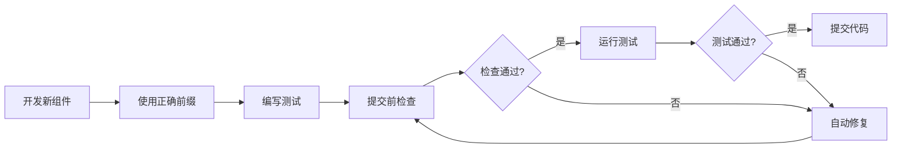

# 测试选择器冲突预防工具包

> **目标**: 彻底避免测试选择器冲突重复发生

## 📦 工具包内容

### 1. 自动检查工具

**`scripts/check-testid-naming.js`**

检查组件文件中的测试选择器命名规范，自动检测：
- ❌ 禁止的通用placeholder（如"搜索"、"输入"）
- ❌ 重复的placeholder文本
- ❌ 重复的data-testid

**使用方法**:
```bash
# 检查所有组件
pnpm check:testid

# 检查特定组件
node scripts/check-testid-naming.js src/app/components/TopBar.tsx

# 检查特定目录
node scripts/check-testid-naming.js src/app/components
```

**输出示例**:
```
🔍 检查测试选择器命名...

📁 找到 114 个文件

❌ src/app/components/TopBar.tsx
   [行153] forbidden: 禁止使用通用的placeholder
      找到: placeholder="palette.placeholder"

⚠️  发现重复的placeholder:
   "palette.placeholder" 出现在 2 个文件:
     - TopBar.tsx
     - CommandPalette.tsx

⚠️  共发现 3 处问题

📝 建议修复：
   1. 为组件添加唯一前缀，如 "topbar-", "palette-"
   2. 避免使用通用的placeholder文本
   3. 使用重命名脚本: node scripts/fix-testid-prefix.js
```

---

### 2. 自动修复工具

**`scripts/fix-testid-prefix.js`**

自动为单个组件添加唯一前缀：
- ✅ 自动识别组件名
- ✅ 为所有data-testid添加前缀
- ✅ 为所有placeholder添加前缀
- ✅ 生成修改报告

**使用方法**:
```bash
# 修复TopBar组件
pnpm fix:testid TopBar src/app/components/TopBar.tsx

# 或者
node scripts/fix-testid-prefix.js TopBar src/app/components/TopBar.tsx
```

**输出示例**:
```
🔧 开始修复测试选择器前缀...

📋 修改报告:
   组件名: TopBar
   前缀: topbar-

   📝 共修改 5 处:

   data-testid:
      "search-input" → "topbar-search-input"
      "connection-status" → "topbar-connection-status"
      "lang-switcher" → "topbar-lang-switcher"
      "user-avatar" → "topbar-user-avatar"

   placeholder:
      "palette.placeholder" → "topbar.search.placeholder"

💡 提示:
      记得同步更新测试文件中的选择器！
      例如: screen.getByPlaceholderText("topbar.search.placeholder")

✅ 已修复: src/app/components/TopBar.tsx
```

---

### 3. 批量修复工具

**`scripts/fix-all-testids.js`**

一键修复所有组件的测试选择器前缀。

**使用方法**:
```bash
# 修复所有组件（默认src/app/components）
pnpm fix:all-testids

# 修复特定目录
node scripts/fix-all-testids.js src/app/components/ai-family
```

**输出示例**:
```
🚀 批量修复测试选择器前缀

📁 目标目录: src/app/components

📊 找到 114 个组件文件

开始处理...

✅ src/app/components/TopBar.tsx
✅ src/app/components/CommandPalette.tsx
✅ src/app/components/Dashboard.tsx
...

============================================================
📊 修复完成统计:

   ✅ 已修复: 45 个文件
   ⏭️  已跳过: 69 个文件
   ❌ 失败: 0 个文件

📝 下一步操作:
   1. 检查修复后的文件，确认修改正确
   2. 更新相关测试文件
   3. 运行测试: pnpm test
   4. 运行检查: pnpm check:testid

💡 提示:
   - 某些组件可能需要手动调整前缀
   - 测试文件需要同步更新选择器
   - 参考: docs/测试选择器冲突预防方案.md

🎉 已成功修复 45 个组件！
```

---

## 🚀 快速开始

### 场景1: 开发新组件

1. **创建组件时**使用正确的命名：
```typescript
// MyComponent.tsx
const MyComponent = () => {
  return (
    <div data-testid="mycomponent-container">
      <input
        placeholder="mycomponent.search.placeholder"
        data-testid="mycomponent-search-input"
      />
    </div>
  );
};
```

2. **提交前检查**:
```bash
pnpm check:testid
```

3. **如果发现问题，自动修复**:
```bash
pnpm fix:testid MyComponent src/app/components/MyComponent.tsx
```

---

### 场景2: 修复现有冲突

当你发现测试失败时（如"Found multiple elements"）：

1. **检查问题**:
```bash
pnpm check:testid src/app/components/TopBar.tsx
```

2. **自动修复**:
```bash
pnpm fix:testid TopBar src/app/components/TopBar.tsx
```

3. **更新测试文件**:
```typescript
// TopBar.test.tsx
// 修改前
expect(screen.getByPlaceholderText("palette.placeholder")).toBeInTheDocument();

// 修改后
expect(screen.getByPlaceholderText("topbar.search.placeholder")).toBeInTheDocument();
```

---

### 场景3: 一次性修复所有组件

适合大规模代码清理：

1. **批量修复**:
```bash
pnpm fix:all-testids
```

2. **批量更新测试**:
```typescript
// 使用正则表达式批量替换
// 查找: getByPlaceholderText\("([^"]+)"\)
// 替换: getByPlaceholderText("topbar.\1")
```

3. **运行测试验证**:
```bash
pnpm test
```

---

## 🔧 预提交钩子（Pre-commit）

自动在提交前检查测试选择器命名：

1. **添加钩子**:
```bash
# package.json已配置
"scripts": {
  "precommit": "pnpm check:testid && pnpm lint:fix && pnpm type-check"
}
```

2. **安装husky**:
```bash
npm install -D husky
npx husky install
npx husky add .husky/pre-commit "pnpm precommit"
```

3. **现在每次提交前会自动检查**:
```bash
git commit -m "feat: add new component"
# 自动运行：
# ✓ pnpm check:testid
# ✓ pnpm lint:fix
# ✓ pnpm type-check
```

---

## 📋 日常工作流

### 开发新功能

```bash
# 1. 创建组件
touch src/app/components/NewFeature.tsx

# 2. 编写组件（使用正确的前缀）
# data-testid="newfeature-element"
# placeholder="newfeature.search.placeholder"

# 3. 编写测试
touch src/app/__tests__/NewFeature.test.tsx

# 4. 提交前检查
pnpm check:testid

# 5. 运行测试
pnpm test

# 6. 提交代码
git add .
git commit -m "feat: add new feature"
```

### 修复测试失败

```bash
# 1. 运行测试，发现失败
pnpm test

# 2. 检查问题组件
pnpm check:testid src/app/components/FailedComponent.tsx

# 3. 自动修复
pnpm fix:testid FailedComponent src/app/components/FailedComponent.tsx

# 4. 更新测试文件
# 修改选择器匹配新的前缀

# 5. 验证修复
pnpm test src/app/__tests__/FailedComponent.test.tsx

# 6. 提交修复
git add .
git commit -m "fix: resolve test selector conflicts"
```

### 大规模代码清理

```bash
# 1. 检查所有组件
pnpm check:testid

# 2. 批量修复
pnpm fix:all-testids

# 3. 更新测试文件（可能需要手动调整）

# 4. 验证所有测试
pnpm test

# 5. 提交更改
git add .
git commit -m "refactor: add unique testid prefixes to all components"
```

---

## 📊 效果对比

### 修复前（易冲突）

```typescript
// TopBar.tsx
<input placeholder="palette.placeholder" data-testid="search-input" />
<div data-testid="connection-status">connected</div>

// CommandPalette.tsx
<input placeholder="palette.placeholder" data-testid="search-input" /> // 冲突！
<div data-testid="connection-status">connected</div> // 冲突！

// 测试失败
screen.getByPlaceholderText("palette.placeholder") // 找到2个！
screen.getByTestId("search-input") // 找到多个！
```

### 修复后（无冲突）

```typescript
// TopBar.tsx
<input placeholder="topbar.search.placeholder" data-testid="topbar-search-input" />
<div data-testid="topbar-connection-status">connected</div>

// CommandPalette.tsx
<input placeholder="palette.search.placeholder" data-testid="palette-search-input" /> // 唯一！
<div data-testid="palette-connection-status">connected</div> // 唯一！

// 测试通过
screen.getByPlaceholderText("topbar.search.placeholder") // 只找到1个
screen.getByTestId("palette-search-input") // 只找到1个
```

---

## 💡 最佳实践

### DO ✅

1. **始终使用组件前缀**
```typescript
data-testid="mycomponent-element"
placeholder="mycomponent.search.placeholder"
```

2. **提交前运行检查**
```bash
pnpm check:testid
```

3. **发现冲突立即修复**
```bash
pnpm fix:testid ComponentName path/to/Component.tsx
```

4. **使用具体的选择器**
```typescript
// ✅ 具体且唯一
screen.getByTestId('topbar-search-input')
```

### DON'T ❌

1. **不要使用通用的选择器**
```typescript
// ❌ 太通用
data-testid="search-input"
placeholder="搜索"
```

2. **不要复制粘贴忘记修改**
```typescript
// ❌ 复制CommandPalette到TopBar，忘记改前缀
<input placeholder="palette.search.placeholder" />
```

3. **不要跳过代码检查**
```bash
# ❌ 直接提交
git push origin main

# ✅ 先检查
pnpm check:testid
git push origin main
```

---

## 📞 故障排查

### 问题1: 检查脚本报错

**症状**: 运行`pnpm check:testid`时报错

**解决方案**:
```bash
# 确保脚本有执行权限
chmod +x scripts/check-testid-naming.js

# 直接使用node运行
node scripts/check-testid-naming.js
```

### 问题2: 修复后测试仍然失败

**症状**: 组件已添加前缀，但测试仍然失败

**解决方案**:
```typescript
// 检查测试文件是否同步更新
// 修改前
screen.getByPlaceholderText("palette.placeholder")

// 修改后
screen.getByPlaceholderText("topbar.search.placeholder")
```

### 问题3: 批量修复后某些组件需要手动调整

**症状**: 前缀不符合预期

**解决方案**:
```typescript
// 手动调整特定组件
// 例如：将 "monitor-" 改为 "dashboard-"

// 然后重新检查
pnpm check:testid
```

---

## 📖 相关文档

- [测试选择器冲突预防方案](../docs/测试选择器冲突预防方案.md) - 完整的预防指南
- [测试失败诊断报告](../docs/测试失败诊断报告.md) - 测试问题诊断
- [AGENTS.md](../AGENTS.md) - 项目开发规范

---

## 🎯 总结

### 三个核心命令

| 命令 | 功能 | 使用场景 |
|------|------|----------|
| `pnpm check:testid` | 检查命名规范 | 提交前、开发新组件 |
| `pnpm fix:testid <组件> <路径>` | 修复单个组件 | 发现冲突时 |
| `pnpm fix:all-testids` | 批量修复所有组件 | 大规模代码清理 |

### 工作流程



---

*持续改进，避免重复感染！* 🚀
